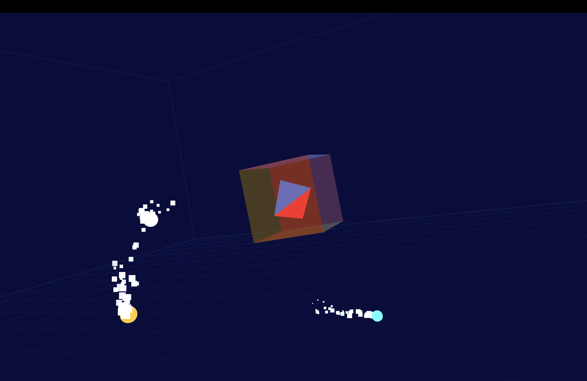

# OGRE Hello World

OGRE（Object-Oriented Graphics Rendering Engine）を使った最小構成の Hello World 3D アプリです。  
頂点カラー付きの立方体が回転しながら描画される 3D ウィンドウを表示します。

---

## Features

* **3D レンダリングエンジン** — C++ 向けの老舗オープンソース 3D グラフィックスエンジンです
* **OgreBites** — ウィンドウ生成・入力処理・レンダーループをまとめた便利なラッパーです
* **RTShaderSystem** — 固定機能パイプラインを GLSL/HLSL シェーダーで自動置換します
* **ManualObject** — ランタイムに頂点データを直接構築できるプリミティブです

---

## ディレクトリ構成

```text
hello_ogre/
├── CMakeLists.txt
└── main.cpp
```

---

## 要件

* macOS（Apple Silicon / Intel）
* CMake 3.16 以上
* OGRE 1.12 以上（OgreBites・RTShaderSystem コンポーネントを含む）

---

## OGRE のインストール（ソースビルド）

Homebrew に `ogre` formula は存在しないため、ソースからビルドします。

### Initial Setup

```sh
# 依存ライブラリのインストール
brew install cmake sdl2 freetype freeimage

# OGREのビルド
git clone --recurse-submodules https://github.com/OGRECave/ogre.git
cd ogre

mkdir build -p && cd build
cmake .. \
  -DCMAKE_INSTALL_PREFIX=$HOME/ogre-dist \
  -DOGRE_BUILD_COMPONENT_BITES=ON \
  -DOGRE_BUILD_COMPONENT_RTSHADERSYSTEM=ON
cmake --build . --config Release
cmake --install .
cd ../../
```

## Build & Run

```sh
cd hello_ogre
mkdir -p build && cd build
cmake -DCMAKE_PREFIX_PATH=$HOME/ogre-dist ..
make && ./ogre_hello
```

実行すると次のようなウィンドウが表示されます。



### 備考

`cmake` 実行時に `hello_ogre/plugins.cfg.in` から `build/plugins.cfg` を自動生成します。  
そのため、`$HOME/ogre-dist/bin/plugins.cfg` を手動で編集する必要はありません。
